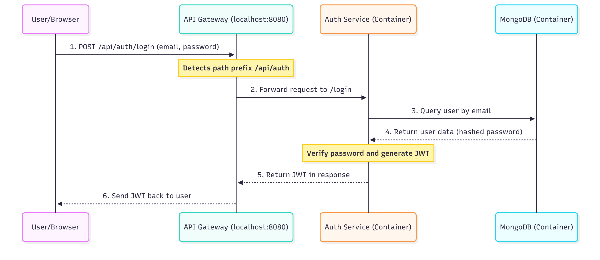

# Sarthi 1.0 - All in one Campus Utility


A full-stack web application designed to facilitate cab pooling, ride-sharing, buy/sell and others within the IIIT Guwahati campus community. This project aims to connect students and faculty, making travel more affordable, social, and environmentally friendly.

---

## Project Overview

Sarthi 1.0 allows users to book a cab and make it available for others to join, or to discover and join existing rides created by other campus members. By sharing rides, especially for common destinations like the airport, users can significantly reduce travel costs, build community connections, and minimize their carbon footprint. The platform prioritizes safety by ensuring that all users are members of the campus community.

---

## Features

### Implemented ✅
- **Microservices Architecture**: Architected the backend using Docker with an API Gateway and distinct services for scalability and maintainability.
- **MERN Stack Foundation**: Set up a robust project structure with a Node.js/Express backend and a React (Vite) frontend.
- **Containerized Environment**: Integrated Docker and Docker Compose for consistent development and deployment.
- **Collaborative Workflow**: Established a Git repository with a comprehensive `.gitignore` file for safe team collaboration.
- **Client-Side Routing**: Implemented `react-router-dom` to manage navigation.
- **Modern UI Components**: Developed a stylish, responsive landing page as the entry point to the application.
- **User Authentication**(./Sequence_diagram_auth_service.png): Secure sign-up and login for students and faculty.
  
- **Ride Management Backend**: Backend logic for creating, viewing (with basic filters), updating, deleting, joining, and leaving rides is implemented in the `ride-service`.
- **Marketplace Backend**: Backend logic for creating, viewing (with filters), updating, deleting marketplace listings, viewing user-specific listings, and marking items as sold is implemented in the `marketplace-service`.
### Planned ⏳
- **Ride Management**: Allow users to create, view, and manage their cab bookings.
- **Frontend Integration**: Connect frontend components to backend API endpoints for authentication, data fetching, and data submission.
- **Ride Discovery**: A searchable interface for users to find available rides based on date and destination.
- **Join Request System**: Functionality for users to request to join a ride, with notifications sent to the ride creator.
- **Automatic Cost Splitting**: The system will automatically recalculate and split the cost among all passengers as more people join.
- **Testing**: Implement comprehensive unit, integration, and end-to-end tests.
- **Enhanced Security & Error Handling**: Add input validation, rate limiting, and more robust error handling across all services.

---

## Tech Stack

- **Backend**: Node.js, Express.js
- **Frontend**: React, Vite
- **Database**: MongoDB (with Mongoose)
- **Containerization**: Docker, Docker Compose
- **Testing**: Jest, Supertest
- **Version Control**: Git & GitHub

---

## Project Structure

The project follows a microservices architecture, with a separate frontend and a backend composed of multiple independent services managed by an API Gateway.

```
/
├── frontend/
│   ├── src/
│   └── package.json
│
├── services/
│   ├── api-gateway/      # Routes incoming requests to the correct service
│   │   ├── gateway.js
│   │   └── package.json
│   │
│   └── auth-service/     # Handles user authentication and management
│       ├── controllers/
│       ├── models/
│       ├── routes/
│       ├── server.js
│       └── package.json
│
├── .env                  # Environment variables for all services
├── docker-compose.yml    # Defines and runs the multi-container application
└── package.json
```

### Directory Overview

- **`frontend/`** - Client-side application built with React and Vite
- **`services/`** - Backend microservices
  - **`api-gateway/`** - Central routing service that directs requests to appropriate microservices
  - **`auth-service/`** - Authentication and user management service
- **`.env`** - Configuration file containing environment variables
- **`docker-compose.yml`** - Container orchestration configuration
- **`package.json`** - Root package configuration

---

## API Endpoints

All requests are routed through the API Gateway.

| Method | Endpoint | Description | Status |
|:-------|:---------|:------------|:-------|
| `GET` | `/api/status` | Checks if the backend server is running. | Planned |
| `POST` | `/api/rides` | Creates a new ride booking. | Planned |
| `GET` | `/api/rides/search` | Searches for available rides. | Planned |
| `POST` | `/api/rides/:id/join` | Requests to join an existing ride. | Planned |
| `POST` | `/api/auth/register` | Registers a new user. | Planned |
| `POST` | `/api/auth/login` | Logs in a user. | Planned |

---

## Getting Started

Follow these instructions to get the entire application running on your local machine using Docker.

### Prerequisites

- Node.js (v18 or later)
- npm
- **Docker** and **Docker Compose**

### Installation & Setup

1.  **Clone the repository:**
    ```bash
    git clone https://github.com/ringerH/Sarthi-1.0
    cd Sarthi-1.0
    ```

2.  **Create the Environment File:**
    
    Create a `.env` file in the project root. Copy the contents of `.env.example` (if available) or use the following template:
    
    ```env
    # .env
    MONGO_URI=mongodb://mongo:27017/sarthi_db
    JWT_SECRET=your_super_secret_key_that_is_long_and_secure
    ```

3.  **Build and Run the Application:**
    
    Use Docker Compose to build the images and start all the services (API Gateway, Auth Service, MongoDB, etc.).
    
    ```bash
    docker-compose up --build
    ```
    
    - The **API Gateway** will be accessible at `http://localhost:8080`.
    - The **Frontend** (once added to Docker Compose) will run on its specified port.

---

## License

This project is licensed under the MIT License.

---

## Contributing

Contributions are welcome! Please feel free to submit a Pull Request.

---

## Contact

For any questions or suggestions, please open an issue on GitHub.
